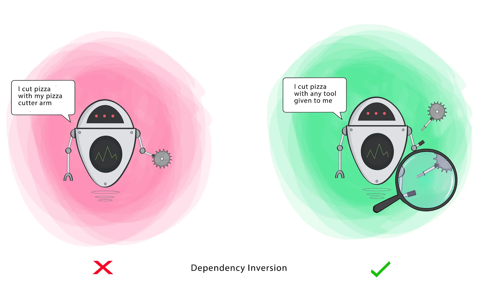

# Dependency Inversion Principle.
The Dependency Inversion Principle (DIP) states that:
1. High-Level modules should not depend on low-level modules. Both should depend on abstractions.
2. Abstractions should not depend on details. Details shoudl depend on abstractions.

* Why Dependency Inversion Principle important?
* Prevents tight coupling between classes.
* Makes the system scalable and maintainable.
* Allows dependency injection (DI), making testing easier.

In software development, two often misunderstood concepts. -- Dependency Injection (DI) and the Dependency Inversion Principle (DIP) -- play crucial roles in building scalable, maintainable, and testable applications. While they are closely related, they serve differenct purposes.

Dependency Injection is a design pattern focused on how dependencies are provided to a class, making code more modular and easier to test. On the other hand, the Dependency Inversion Princple, part of the SOLID principles, is a design guideline that encourages us to depend on asbtractions rather than concrete implmentations.

In this post, we'll explore these two concepts, how they relate to each other and how they differ in purpose and implementation.

Dependency Injeciton (DI)
It is a design pattern where a class receives (or is "injected with") the dependencies it needs from the outside, rather than creating them itself. This pattern enhances modularity, testability and flexibility in an application.

* Key Concepts:
1. Dependency: A class that another class relies on to perform its tasks.
2. Injection: providing that dependency from an external sources, usually through the constructor, a method or a property.

Types of Injection:

* Constructor Injection: Dependencies are passed as constructor parameters.

class Service {
  private final Repository repository;

  public Service(Repository repository) {
    this.repository = repository;
  }
}

* Setter Injection: Dependencies are provided via setter methods.

class Service {
  private Repository repository;

  public void setRepository (Repsitory repository) {
    this.repository = repository;
  }
}

Advantages of Dependency Injection:
* Decoupling: Classed depend on abstraction rather that concrete implementations.
* Testability: Mocks and stubs can be easily injected for unit testing.
* Flexibility: Dependencies can be changed without altering the dependent class.

### Example without Dependency Injection
In this example, Service class directly create an instance of MySQLRepository within its implementation. This creates a rigid dependency between Service and MYSQLRepository, making it harder to switch implementations of perform testing.

public class MySQLRepository {
  public void save(String data) {
    System.out.println("data save is MySQL repository.");
  }
}

public class Service {
  MySQLRepository mysqlRepository;

  public Service (MySQLRepository mysqlRepositoyr) {
    this.mysqlRepository = mysqlRepository;
  }

  public void save (String data) {
    mysqlRepository.save(data);
  }
}

public class Main {
  public static void main(String[] args) {
    Service service = new Service();
    service.saveData("Test data");
  }
}

* Problems:
1. Service directly depends on the concrete implementation (MySQLRepository), violating the Dependency Inversion Principle.
2. It's inflexible. Changing to another implementation of Repository (e.g., PostgresRepository) would require modifying the Service code.
3. It's hard to test since you cannot inject a mock or stub of MySQLRepository.
4. It's violates Open/Closed Principle. We need to modify Service class everytime we have necessity of creating a new database.

### Solution with Dependency Injection
Here, we apply dependency injection to decouple Service from the specific implementation of Repository

public interface Repository {
  public void save(String data);
}

public class MySQLRepository  extends Repository{
  public void save(String data) {
    System.out.println("Mysql database.");
  }
}

public class PostgreSQL extends Repository {
  public void save(String data) {
    System.out.println("PostgreSQL database.");
  }
}

public class Service {
  private Repository repository;
  public class Service (Repository repository) {
    this.repository = repository;
  }

  public void saveData(String data) {
    repository.save(data);
  }
}

public class Main {
  public static void main(String[] args) {
    Repository repository = new MySQLRepository();
    Service service = new Service(Repository);
    service.saveData("mysql test data");

    Repository repository = new PostgreSQL();
    Service service = new Service(repository);
    service.saveData("Postgresql test data");
  }
}

Advantages of the solution:
1. Decoupling: Service depends on an interface (Repository), not on concrete implementations (MySQLRepository or PostgresRepository).
2. Flexibility: Changing the Repository implementation is a simple as instantiating a different class (PostgresRepository).
3. Testability: You can inject a mock or stub of Repository to perform unit tests without relying on real databases.

Example using E-commerce App
Example 1: Payment Processing

Bad Practice:
public class PaypalPayment {
  public void pay(double amount) {
    System.out.println("Paid $" + amount + " via PayPal.");
  }
}

public class PaymentService {
  private PaypalPayment paypalPayment;

  public PaymentService() {
    this.paypalPayment = new PaypalPayment();
  }

  public void processPayment(double amount) {
    paypalPayment.pay(amount);
  }
}

* Problmes:
* Tightly coupled to PaypalPayment. If we want to add Stripe or Razorpay, we must modify PaymentService.
* Difficult to test, as we cannot easily mock PaypalPayment.

Good Practice:
Step 1: Create an Abstraction (Interface)
public interface Payment {
  void pay(double amount);
}

Step 2: Implement Different Payment Providers
public class PaypalPayment implements Payment {
  @Override
  public void pay(double amount) {
    System.out.println("Paid $" + amount + " via PayPal.");
  }
}

public class Stripe implements Payment {
  @Override
  public void pay(double amount) {
    System.out.println("Paid $" + amount + " via Stripe.");
  }
}

Step 3: Use Dependency Injection (Spring Boot)

@Service
public class PaymentService {
  private final Payment payment;

  public PaymentServie(Payment payment) {
    this.payment = payment;
  }

  public void processPayment(double amount) {
    paymentProcessor.pay(amount);
  }
}

@ComponentScan
@Primary
public class PaypalPayment implements Payment {
  @Override
  public void pay(double amount) {
    System.out.println("Paid $" + amount + " via PayPal.");
  }
}

@ComponentScan
public class StripePayment implements Payment {
  @Override
  public void pay(double amount) {
    System.out.println("Paid $" + amount + " via Stripe.");
  }
}
