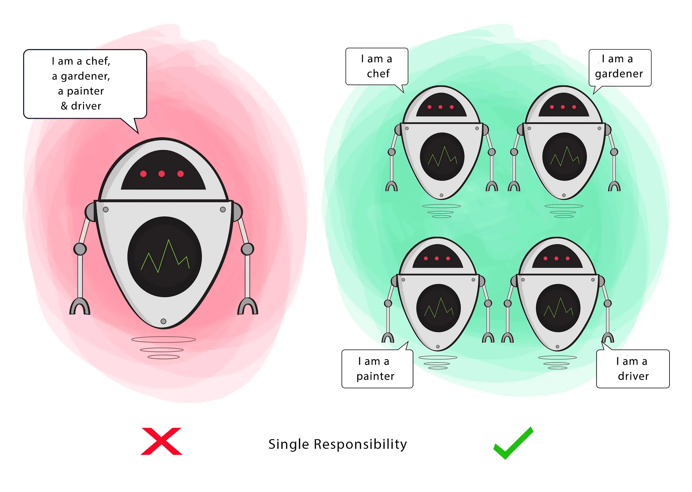
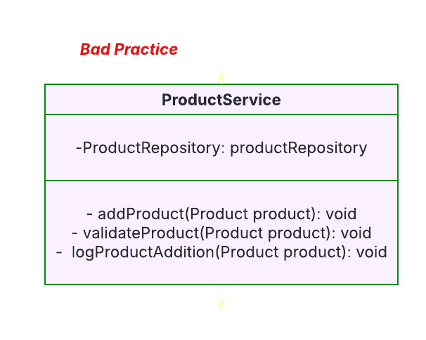

# Single Responsibility Principle (SRP)
>Definition: A class should have only one reason to change.
This means a class should do only one thing and be responsible for one piece of functionality.



### How does this principle help us to build better software?

**1. Testing - A class with one responsibility will have far fewer test cases. <br>
2. Lower coupling - Less functionality in a single class will have fewer dependencies.<br>
3. Organization - Smaller, well-organized classes are easier to search than monolithic ones.**<br>
**Here is a simple example:**
```
public class Employee {
    public String getDesignation(int employeeId) { //implementation }
    public void updateSalary(int employeeId) { //implementation }
    public void sendMail() { //implementation }
}
```
**We can see, this class violates the single responsibility principle, we have more than one reason to change because in updateSalary and getDesignation has same Employee class behavior. But sendMail is not specific to Employee class we can move it to a separate class.**

```
public class Employee {
    public String getDesignation(int employeeId) { // implementation }
    public void updateSalary(int employeeId) { // implementaion }
}

public class NotificationService {
    public void sendMain() { // }
}
```

## How Spring Maintain Single Responsibiltiy Principle
### Java persistence API (JPA) Specification
JPA is a specification that defines how Java applications interact with relational databases using Object-Relational Mapping (ORM).
<br><br>
It has only one responsibility: to standardize database management in Java applications.

Even though JPA includes many features like: <br>
* Entity lifecycle states (how objects interact with the database). <br>
* Entity management <br>
* JPQL (Java persistence Query Language) <br>
<br>
It does not handle other functionalities like: <br>
* Validation <br>
* REST APIs <br>
* Logging <br>

### JPA Entity Manager: A Clear Example of SRP
The EntityManageer interface is responsible for managing entities within a persistence context. Its job is to provide methods for:

**1. Saving entities <br>
2. Updating entities <br>
3. Deleting entities <br>
4. Fething entities <br>**

However, EntityManager does not:
**Implement business logic <br>
Handle user authentication <br>
Manage validation <br>**

Because of this clear separation, the EntityManager only changes when databse management rules change.<br>

### Spring Data Repository -- Applying SRP to Database Operations
Spring Data JPA simplifies database interactions by providing repositories that act as an abstraction layer over JPA.
<br>
For example, a Spring Data Repository is responsible for CRUD (Create, Read, Update, Delete) operations for a specific entity.<br>
<br>
Example: <br>
```
interface AuthorRepository extends CrudRepository<Author, Long> {
    List<Author> findByLastName(String lastName);
}
```
<br>

* CrudRepsitory provides standard database operations like save(), delete(), findById(), and findAll().<br>
* findByLastName(String lastName) allows searching authors by their last name.<br>

###Why does this follow SRP?<br>

**The repository only deals with database operations.<br>
It does not handle validation, authentication or business logic.<br>
I does not deal with other enitities.<br>**

This seperation of concerns makes repositories easy to maintain and understand.<br>

Summary:
**JPA itself follows Single Responsibility Principle by focusing only one database management. <br>
Entity Manager manages entities but does not handle business logic. <br>
AttributeConverted converts data types, keeping conversion logic separate. <br>
Spring Data Repositories manage database operations for a single entity, without adding extra responsiblitites. <br>**

**Single Responsiblity Principle makes our code cleaner, easier to understand and less prone to errors.**

Here are more examples to understand it better:

## Example 1: User Management
**Bad Practice: Violating Single Responsibility Principle**

**1. Database operations <br>
2. Password hashing <br>
3. Email notification** <br>


```
@Service
public class UserService {
    @Autowired
    private UserRepository userRepository;

    public void registerUser(User user) {
        String hashedPassword = hashPassword(user.getPassword());
        user.setPassword(hashedPassword);
        userRepository.save(user);
        sendWelcomeEmail(user.getEmail());
    }

    private String hashPassword(String password) {
        return BCrypt.hashpw(password, BCrypt.gensalt());
    }

    private void sendWelcomeEmail(String email) {
        System.out.println("Sending welcome email to: " + email);
    }
}
```

**Good Practice: Single Responsibility Principle Applied**


```
@Service
public class PasswordService {
    public String hashPassword(String password) {
        return BCrypt.hashpw(password, BCrypt.gensalt());
    }
}
```

```
@Service
public class EmailService {
    public void sendWelcomeEmail(String email) {
        System.out.println("Sending welcome email to: " + email);
    }
}
```

```
@Service
public class UserService {
    private final UserRepository userRepository;
    private final PasswordService passwordService;
    private final EmailService emailService;

    public UserService(UserRepository userRepository, PasswordService passwordService, EmailService emailService) {
        this.userRepository = userRepository;
        this.passwordService = passwordService;
        this.emailService = emailService;
    }

    public void registerUser(User user) {
        user.setPassword(passwordService.hashPassword(user.getPassword()));
        userRepository.save(user);
        emailService.sendWelcomeEmail(user.getEmail());
    }
}

```
### Single Responsibility Principles Benefits
**Code is now modular and reusable. <br>
Easier to test password hashing, email, and user management separately.<br>
Future changes: changing hashing method don't affect the UserService.** <br>


## Example 2: Product Management in an E-commerce App

**Bad Practice: <br> All responsibilities in one class.**


```
@Service
public class ProductService {
    @Autowired
    private productRepository productRepository;

    public void addProduct(Product product) {
        validateProduct(product);
        productRepository.save(product);
        logProductAddition(product);
    }

    private void vaidateProduct(Product product) {
        if(product.getPrice() <= 0) {
            throw new IllegalArgumentException("Invalid product price.");
        }
    }

    private void logProductAddition(Product product) {
        System.out.println("Product added: " + product.getName());
    }
}
```

**Good Practice:**<br>**We split responsibilites into three classes:**

**1. ProductService -> Handles prouct operations <br>
2. ProductValidator -> Validates product data <br>
3. LoggerService -> Logs product additions <br>**


```
@Component
public class ProductValidator {
    public void validate(Product product) {
        if(product.getPrice() <= 0) {
            throw new IllegalArgumentException("Invalid product price.");
        }
    }
}
```

```
@Service
public class LoggerService {
    public void log(String message) {
        System.out.println("LOG: " + message);
    }
}
```

```
@Service
public class ProductService {
    private final ProductRepository productRepository;
    private final ProductValidator productValidator;
    private final LoggerService loggerService;

    public ProductService(ProductRepository productRepository, ProductValidator productValidator, LoggerService loggerService) {
        this.productRepository = productRepository;
        this.loggerService = loggerService;
        this.productValidator = productValidator;
    }

    public void addProduct(Product product) {
        productValidator.validate(product);
        productRepository.save(product);
        loggerService.log("Product added: " + product.getName());
    }
}
```
**Benefits: <br>
1. Easy to extend - can modify validation without touching ProductService. <br>
2. Better reusability - LoggerService can be used in other classes**

## Example 3: Order Processing with JPA
### Bad Practice (Violating Single Responsibility Principle)

<br>
**Here, OrderServie mixes responsibilities with:
1. Order creation
2. Discount calculation
3. Stock validation**

```
@Service
public class OrderService {
    @Autowired
    private OrderRepository orderRepository;
    @Autowired
    private ProductRepository productRepository;

    public void createOrder(Order order) {
        double discount = applyDiscount(order);
        if(!validateStock(order)) {
            throw new RuntimeException("Insufficient stock);
        }
        order.setTotalAmount(order.getTotalAmount() - discount);
        orderRepository.save(order);
    }

    private double applyDiscount(Order order) {
        return order.getTotalAmount() * 0.10;
    }

    private boolean validateStock(Order order) {
        for (OrderItem item : order.getItems()) {
            Product product = productRepository.findById(item.getProductId()).orElseThrow();
            if(product.getStock() < item.getQuantity()) {
                return false;
            }
        }
        return true;
    }
}
```

### Good Practice (Single Responsibility Principle Applied)

**Discont Service**
```
@Service
public class DiscountService {
    public double applyDiscount (Order order) {
        return order.getTotalAmount() * 0.10;
    }
}
```
**Stock Validator Service**
```
@Service
public class StockValidator {
    @Autowired
    private ProductRepository productReposityr;

    public boolean validateStock (Order order) {
        for (OrderItem item : order.getItems()) {
            Product product = productRepository.findById(item.getProductId()).orElseThrow();
            if(product.getStock() < item.getQuantity()) {
                return false;
            }
        }
        return true;
    }
}
```

**Order Service (Now follwing SRP)**
```
@Service
public class OrderService {
    private final OrderRepository orderRepository;
    private final DiscountService discountService;
    private final StockValidator stockValidator;

    public OrderService(OrderRepository orderRepository, DiscountService discoundService, StockValidator stockValidator) {
        this.orderRepository = orderRepository;
        this.discountService = discountService;
        this.stockValidator = stockValidator;
    }

    public void createOrder(Order order) {
        double discount = discountService.applyDiscount(order);
        if(!stockValidator.validateStock(order)) {
            throw new RuntimeException("Insufficient stock");
        }
        order.setTotalAmouint(order.getTotalAmount() - discount);
        orderRepository.save(order);
    }
}
```

### Summary:
**Good Practice:**
Each class has a single responsibility <br>
Easy to test <br>
Easy to modify <br>
**Bad Practice:**
One class does multiple things. <br>
Hard to test. <br>
Hard to modify. <br>
